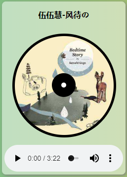

# AeroPlayer
Aero风格、精美小巧的HTML5音乐播放器

## 界面



## 特性
* 外链播放
* 渐变色主题/插画风格切换
* 丰富的快捷键操作
## 兼容性
* 浏览器支持
  * Internet Explorer 9+
  * Chrome/Firefox/Microsoft Edge/Opera/Safari
* 音频格式支持
  
||Chrome|Firefox|IE9|Opera|Safari|
|------|-----|-----|-----|-----|-----|
|OGG|√|√|√|√|√|
|MP3|√|×|√|×|√|
|WAV|×|√|×|√|×|

## API
### player.js

#### 1、播放列表

- list_fun(flag)
  描述：列表项通用方法
  参数0：绑定列表项的点击事件 
  参数1：清楚先前列表项的背景色

- list_play()
  描述：单击列表项播放对应的音乐的

- changeColor()
  描述：清楚所有列表项的先前颜色，并赋予当前项新的背景色

  ```
  list_fun(1);
  this.style = "color:white;background-color:#38f;";
  ```
- clearPlaying()
  描述：清除播放列表的“播放中”标志
- playURL()
  描述：根据用户给定的地址和歌曲名添加音乐到播放列表中
- preSong()
    描述：遍历播放列表并根据播放中的音乐切换焦点到下一首
- nextSong()
    描述：描述：遍历播放列表并根据播放中的音乐切换焦点到下一首
#### 2、音乐控件

* songPlay()

  描述：当音乐播放进行时，开始旋转封面

* songPause()

  描述：当音乐播放暂停时，暂停封面旋转

* rotate()

  描述：将封面以一定的速度和角度进行旋转

* catchKeyDown()

  描述：监控键盘的键位输入并给出相应的操作

### master.js

* randomUI()

  描述：产生两个随机数并将其值应用到渐变色背景的两端 

### animation.js

* list_slideOut()

  描述：滑动显示出播放列表 


## 传送门

在线演示 [https://rainsilver.github.io/RPlayer/](https://rainsilver.github.io/RPlayer/)

Github [https://github.com/RainSilver/rplayer](https://github.com/RainSilver/rplayer/)

## 使用协议
Apache Licence 2.0

## 鸣谢
### 插画资源
|编号|作品名|来源|
|--|--|--|
|01|「梅雨」|ne-on@お仕事募集中|
> from pixiv.com 如侵删
